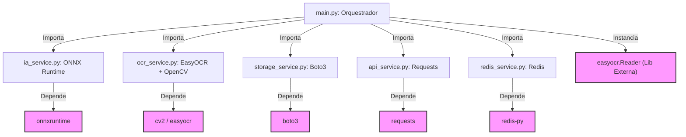

# 🔍 Auditoria de Clean Code e Clean Architecture: `vc-worker-portaria`

Este documento apresenta uma auditoria técnica detalhada sobre o microsserviço **`vc-worker-portaria`**, analisando sua estrutura de código, acoplamento, resiliência, concorrência e adesão aos princípios de **Clean Code** e **Clean Architecture**. Ao final, é proposto um plano prático de refatoração para elevar o serviço a um padrão pronto para produção.

---

## 1. Visão Geral do Serviço

O `vc-worker-portaria` é um worker focado no processamento de imagens em tempo real para reconhecimento de placas veiculares (LPR/OCR). Sua operação orientada a eventos utiliza:
1. **Mensageria**: Redis (`BLPOP` na fila `camera:portaria:queue`).
2. **Armazenamento**: MinIO S3 (`boto3` para downloads e uploads de crops).
3. **Visão Computacional & IA**: YOLOv8 via ONNX Runtime (CPU/GPU) e EasyOCR.
4. **Comunicação**: Envio dos dados via POST HTTP síncrono para o `vc-api-core`.

Embora a escolha tecnológica seja excelente (como o uso do ONNX Runtime para otimizar inferência e Docker multi-stage), a implementação atual sofre com problemas graves de acoplamento, vazamento de responsabilidades e gargalos de I/O síncrono.

---

## 2. Análise de Clean Architecture (Arquitetura Limpa)

O principal objetivo da **Clean Architecture** é a separação de conceitos, isolando as regras de negócio das tecnologias externas e detalhes de infraestrutura (bancos de dados, frameworks, clientes de rede, bibliotecas de IA). As dependências do código fonte devem apontar apenas para dentro (na direção das políticas de alto nível).



### 2.1. Violação do Princípio da Inversão de Dependências (DIP)
O DIP estabelece que *módulos de alto nível não devem depender de módulos de baixo nível; ambos devem depender de abstrações*. 
No design atual do worker:
* **`main.py`** (o orquestrador de alto nível do caso de uso) importa e instancia classes concretas de infraestrutura de terceiros, como o `easyocr.Reader` (linha 15) e depende diretamente do objeto retornado de `carregar_modelo` (que é uma `ort.InferenceSession` do ONNX Runtime).
* Se a equipe decidir substituir o **EasyOCR** por outro motor de OCR (ex: *Tesseract*, *Google Cloud Vision API*, ou um modelo customizado em PyTorch), será necessário alterar o `main.py` e o `ocr_service.py`. O mesmo ocorre com o detector YOLOv8 do ONNX Runtime.
* Não existem interfaces, classes abstratas (`abc.ABC`) ou protocolos estruturais (`typing.Protocol`) que definam o comportamento esperado de um `Detector`, de um `OCRReader`, de um `StorageRepository` ou de um `APIClient`.

### 2.2. Vazamento de Regras de Negócio (Domain Logic Leakage)
As regras de negócio do VisionCore deveriam residir em uma camada pura (Domain/Entities). Atualmente, elas estão espalhadas em arquivos de infraestrutura:
* **Dicionários de Correção de Caracteres** (linhas 5-6 de `ocr_service.py`) e a **função `corrigir_placa`** (que implementa as regras brasileiras do formato Mercosul e antigo: `AAA0000` ou `AAA0A00`) estão fortemente acopladas a funções de pré-processamento de imagem do OpenCV (`cv2.cvtColor`, `cv2.bilateralFilter`, etc.) e ao EasyOCR.
* As **regras de status e classificação** da placa (linhas 45-58 de `main.py`), que decidem se o processamento foi um `"sucesso"` ou `"filtrado"` com base no tamanho (`len(texto_placa) != 7`), estão misturadas com a orquestração do loop de eventos.

### 2.3. Acoplamento com Gateway Externo (Nginx)
No arquivo `storage_service.py` (linha 77), a URL pública gerada para a imagem é fixada como:
```python
url_publica = f"/storage/{BUCKET_NAME}/{nome_arquivo}"
```
O serviço assume internamente o conhecimento de como o gateway Nginx externo foi configurado no `parking-infra` para expor o MinIO. Isso quebra o encapsulamento: se o worker for migrado para a nuvem usando AWS S3 de forma direta (gerando URLs pré-assinadas ou caminhos do CloudFront), o código de infraestrutura do S3 precisará ser alterado por conta de uma string de orquestração externa.

---

## 3. Análise de Clean Code (Código Limpo)

### 3.1. Violação do Princípio da Responsabilidade Única (SRP)
Vários módulos assumem múltiplas responsabilidades concomitantes:
* **`main.py`**:
  1. Inicializa modelos pesados de ML na inicialização global.
  2. Implementa regras de filtragem e validação do negócio.
  3. Monta o payload final que é enviado para a API REST.
  4. Realiza a orquestração de I/O de rede e mensageria.
* **`ia_service.py`**:
  1. Pré-processa imagens (`_letterbox`).
  2. Inicializa e gerencia a sessão ONNX Runtime.
  3. Realiza cálculos matemáticos em numpy de pós-processamento (como a implementação customizada de Non-Maximum Suppression — `_nms`).
  4. Realiza o mapeamento de coordenadas reversas da bounding box.
* **`ocr_service.py`**:
  1. Executa filtros OpenCV de aprimoramento de imagem (CLAHE adaptativo local, Filtro Bilateral, binarização Otsu).
  2. Invoca o modelo EasyOCR.
  3. Aplica heurísticas de conversão textual para o padrão brasileiro.

### 3.2. Oportunidades Perdidas de Coesão (Arquivos de Utilidades Vazios)
O projeto possui dois arquivos de utilitários no diretório `src/utils/`:
* `src/utils/image_utils.py` (Vazio)
* `src/utils/text_utils.py` (Vazio)

A presença de arquivos vazios indica que o código não foi modularizado corretamente. Funções auxiliares como `_letterbox`, `_nms` e `pre_processar_imagem` (OpenCV) deveriam habitar o `image_utils.py`. A função `corrigir_placa` e seus dicionários de mapeamento deveriam estar em `text_utils.py`.

### 3.3. Inconsistência de Linguagem (Portunglês)
O código apresenta uma grande mistura de idiomas nas variáveis e funções. Clean Code prega consistência absoluta (preferencialmente utilizando inglês, ou exclusivamente português):
* Mistura de nomes em uma mesma expressão: `placa_crop`, `imagem_numpy`, `resultado_ocr`, `url_binarizada`.
* Funções com nomes em português (`baixar_imagem_s3`) convivendo com argumentos e retornos baseados em jargões ingleses (`chave_arquivo` recebendo `Key`, `ExtraArgs` no S3).
* Dicionários mapeados em português (`dict_int_para_letra`), enquanto lógicas internas usam nomenclaturas em inglês (`coords`, `class_scores`, `mask`, `boxes`, `indices`).

### 3.4. Resiliência Frágil e Perda Oculta de Dados
No loop do evento em `main.py` (linhas 61-65):
```python
url_recorte = upload_imagem_s3(placa_crop, placa_salvar)
if not url_recorte:
    print("[WORKER] Falha ao fazer upload do recorte colorido no MinIO.")
    return
```
Se o MinIO temporariamente falhar no upload do recorte colorido, a execução do evento **aborta** com um `return` silencioso. O evento é considerado "consumido" da fila do Redis (`BLPOP`), mas a API Core nunca recebe nenhuma notificação do ocorrido. O evento é **perdido permanentemente**.
No pipeline de tratamento de erros:
* O uso de catch-all genéricos (`except Exception as e`) mascara erros de conexão e bugs de sintaxe internos, dificultando a depuração automatizada. É ideal filtrar exceções específicas do `requests` (`RequestException`), do `boto3` (`BotoCoreError`) e do `redis` (`ConnectionError`).

### 3.5. Ausência do Módulo Nativo de `logging`
O worker utiliza puramente `print()` para exibir status (como constatado também no `ANALISE_BACKEND.md`). 
* **Problema**: `print` joga tudo na saída padrão (`stdout`) sem qualquer metadado de timestamp, identificação de thread, ou classificação de severidade (DEBUG, INFO, WARNING, ERROR).
* **Impacto**: Em produção (Docker), os logs tornam-se impossíveis de filtrar por gravidade (ex: alertar apenas em `ERROR`), e o tráfego do container não é otimizado para coletores de log modernos (como Kibana, Datadog ou Grafana Loki), que esperam estruturas padronizadas ou logs estruturados em JSON.

### 3.6. Gargalo Crítico de I/O Síncrono
O `main.py` atua em uma única thread síncrona. Durante um ciclo de evento, ele realiza:
1. `BLPOP` bloqueante no Redis (baixo custo).
2. Download de imagem síncrono no MinIO (I/O bloqueante).
3. Inferência pesada em CPU/GPU (YOLOv8 + EasyOCR) (Uso intenso de CPU/GPU).
4. Uploads de imagem síncronos no MinIO (I/O bloqueante).
5. Requisição HTTP POST síncrona para a API (`requests.post`) (I/O bloqueante).

Se a API Core ou o MinIO sofrerem lentidão de rede, a thread do worker ficará **completamente bloqueada** esperando a resposta do socket, impedindo o consumo de novos eventos da fila do Redis. Em um ambiente IoT de estacionamento com múltiplos veículos entrando simultaneamente, o atraso na resposta de rede degradará o "tempo real" do sistema rapidamente.

---

## 4. Plano de Ação para Refatoração (Proposta)

Para corrigir estes problemas de forma robusta, propõe-se uma refatoração em fases, guiada pela Clean Architecture e Clean Code.

### Fase A: Criação de Contratos (Interfaces/Protocols)
Criamos a camada de abstração para isolar os componentes externos da orquestração. Utilizaremos o `typing.Protocol` do Python para definir contratos leves e flexíveis:

```python
# src/core/interfaces.py
from typing import Protocol, Tuple, Optional
import numpy as np

class Detector(Protocol):
    def detectar(self, imagem: np.ndarray) -> Tuple[Optional[np.ndarray], float]:
        """Detecta a placa na imagem e retorna o crop e o score de confiança."""
        ...

class OCRReader(Protocol):
    def ler_texto(self, crop: np.ndarray) -> Tuple[str, str, np.ndarray]:
        """Lê o texto do crop e retorna (texto_filtrado, texto_bruto, imagem_processada)."""
        ...

class StorageRepository(Protocol):
    def baixar_imagem(self, key: str) -> Optional[np.ndarray]:
        """Baixa uma imagem do bucket e converte em array numpy."""
        ...
        
    def upload_recorte(self, imagem: np.ndarray, nome_base: str, sufixo: str = "") -> Optional[str]:
        """Faz o upload do crop e retorna o caminho interno do objeto."""
        ...

class APIClient(Protocol):
    def registrar_passagem(self, payload: dict) -> bool:
        """Envia o registro de tráfego para a API Core."""
        ...
```

Com essas interfaces, o nosso orquestrador (`main.py` ou um caso de uso dedicado) passa a depender apenas desses contratos. As classes concretas (`ONNXDetector`, `EasyOCRReader`, `MinIOStorage`, `FastAPIClient`) serão injetadas ou instanciadas em um arquivo de bootstrapping separado, permitindo a substituição de qualquer infraestrutura sem alterar a regra de negócio central!

---

### Fase B: Limpeza e Coesão (Preenchimento das Utilidades)
Extraímos a lógica matemática e de processamento que estava poluindo os serviços:

#### 1. `src/utils/image_utils.py`
Contém todas as manipulações baseadas em OpenCV e Numpy:
* `letterbox` (redimensionamento com proporção).
* `nms` (Non-Maximum Suppression em numpy).
* `pre_processar_imagem_ocr` (grayscaling, CLAHE, resizing 2x, bilateralFilter, binarização Otsu).

#### 2. `src/utils/text_utils.py`
Contém a lógica pura de higienização de string e heurística das placas brasileiras:
* `corrigir_padrao_placa_br` (uso dos dicionários de conversão baseado nas regras de posições de letras e números do Mercosul).

---

### Fase C: Implementação do Logger Estruturado
Substituímos todos os `print` do projeto por uma configuração robusta usando o módulo nativo `logging` do Python, com formatação padronizada e suporte a múltiplos níveis de log.

```python
# src/core/logger.py
import logging
import sys

def configurar_logger(nome: str = "VisionCoreWorker") -> logging.Logger:
    logger = logging.getLogger(nome)
    logger.setLevel(logging.INFO)
    
    if not logger.handlers:
        handler = logging.StreamHandler(sys.stdout)
        handler.setLevel(logging.INFO)
        
        # Formato limpo e profissional contendo timestamp, nível e mensagem
        formatter = logging.Formatter(
            '[%(asctime)s] [%(levelname)s] [%(name)s] - %(message)s',
            datefmt='%Y-%m-%d %H:%M:%S'
        )
        handler.setFormatter(formatter)
        logger.addHandler(handler)
        
    return logger
```

---

### Fase D: Minimização de Gargalos e Resiliência HTTP
Podemos otimizar o I/O bloqueante implementando timeout restrito nas requisições do `requests` e utilizando um `ThreadPoolExecutor` ou biblioteca assíncrona (`httpx`) caso a volumetria exija concorrência máxima. Além disso, criamos um fallback adequado: se o upload do recorte binarizado secundário falhar, o worker não deve abortar o registro principal na API. Apenas o loga como alerta (`logger.warning`) e envia o payload com a imagem original do crop principal.

---

## 5. Nova Estrutura de Diretórios Proposta

Para materializar o Clean Architecture, a árvore de arquivos evoluiria para:

```
src/
├── __init__.py
├── main.py                  # Ponto de entrada (Bootstrapping dos serviços concretos)
├── config.py                # Variáveis de ambiente validadas
├── core/
│   ├── __init__.py
│   ├── interfaces.py        # Protocols e Abstrações das dependências
│   ├── logger.py            # Módulo de Log centralizado
│   └── use_cases.py         # Regra pura de orquestração do evento (ProcessarEventoUseCase)
├── services/                # Implementação concreta dos adaptadores (Infraestrutura)
│   ├── __init__.py
│   ├── api_service.py       # FastAPIClient (Implementa APIClient)
│   ├── ia_service.py        # ONNXDetector (Implementa Detector)
│   ├── ocr_service.py       # EasyOCRReader (Implementa OCRReader)
│   ├── redis_service.py     # Gerenciamento da fila Redis
│   └── storage_service.py   # MinIOStorage (Implementa StorageRepository)
└── utils/                   # Helpers puros e matemáticos
    ├── __init__.py
    ├── image_utils.py       # Letterbox, NMS, OpenCV preprocess
    └── text_utils.py        # Heurísticas de texto, dicionários de placas BR
```

---

## 6. Conclusão

A arquitetura do `vc-worker-portaria` é altamente inovadora e cumpre sua proposta de valor. O desacoplamento através do Redis impede a sobrecarga direta na API Core.

Ao aplicar as refatorações sugeridas (Inversão de Dependências, centralização de logs, isolamento de regras de texto em utilitários, e aumento de tolerância a falhas na infraestrutura), o microsserviço ganhará:
1. **Facilidade de Manutenção**: Mudar de EasyOCR para outro serviço é questão de criar um novo adapter de 20 linhas, sem mexer no core do fluxo.
2. **Resiliência**: Falhas parciais de rede ou uploads secundários não farão com que tráfegos de veículos válidos "desapareçam" sem registro.
3. **Auditabilidade de Produção**: Logs robustos, tipados e estruturados prontos para ferramentas de telemetria.
